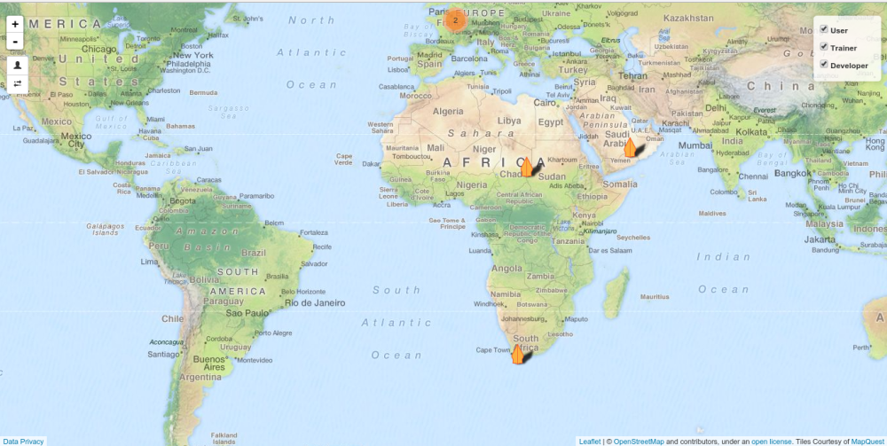
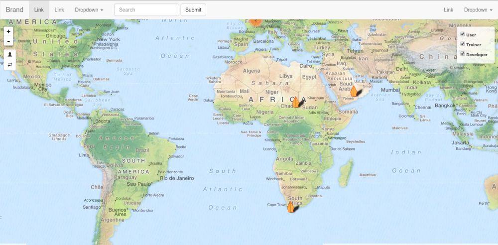

Django User Map
=================

Django User Map is a reusable django application for making community user's 
map. This app relies on the active auth user model and extend that 
model with OneToOne relationship. Users can add themselves on the map by 
providing some additional information:

1. Location on the map
2. Roles (the choices can be configured through setting)
3. Image, and
4. Website


## Installation
* Install django-user-map with pip:

```shell
pip install django-user-map
```

* Make sure you have these modules in INSTALLED_APPS of your django 
   project settings.py:

```python
INSTALLED_APPS = (
    'django.contrib.gis',
    'user_map',
    'leaflet',
    'bootstrapform',
    'rest_framework',
    'rest_framework_gis'
)
```

* Include user-map URLconf in your project urls.py with namespace user_map 
(required) e.g:

```python
url(r'^user-map/', include('user_map.urls', namespace='user_map')),
```

* Configure user map with USER_MAP variable in your project's settings.py or
 override some templates. See [Configurations](#configurations) section for further 
 information.

* Run ```python manage.py migrate``` to migrate the user_map models. 

* Visit the URL that you set before to see the apps.


## Configurations
You can configure Django User Map with one single USER_MAP variable in 
project's settings.py. Below setting is the default. Add this default to your
 project's setting and configure necessary bits that you want to change:

```python   
USER_MAP = {
    'project_name': 'Django',
    'favicon_file': '',
    'login_view': 'django.contrib.auth.views.login',
    'marker': {
        # See leaflet icon valid options here:
        # http://leafletjs.com /reference.html#icon-iconurl
        'iconUrl': 'static/user_map/img/user-icon.png',
        'shadowUrl': 'static/user_map/img/shadow-icon.png',
        'iconSize': [19, 32],
        'shadowSize': [42, 35],
        'iconAnchor': [10, 0],
        'shadowAnchor': [12, 0],
    },
    'leaflet_config': {
        'TILES': [(
            # The title
            'MapQuest',
            # Tile's URL
            'http://otile{s}.mqcdn.com/tiles/1.0.0/osm/{z}/{x}/{y}.png',
            # More valid leaflet option are passed here
            # See here: http://leafletjs.com/reference.html#tilelayer
            {
                'attribution':
                    '© <a href="http://www.openstreetmap.org" '
                    'target="_parent">OpenStreetMap'
                    '</a> and contributors, under an <a '
                    'href="http://www.openstreetmap.org/copyright" '
                    'target="_parent">open license</a>. Tiles Courtesy of '
                    '<a '
                    'href="http://www.mapquest.com/">MapQuest</a> OpenStreetMap'
                '</a> and contributors, under an <a '
                'href="http://www.openstreetmap.org/copyright" '
                'target="_parent">open license</a>. Tiles Courtesy of '
                '<a '
                'href="http://www.mapquest.com/">MapQuest</a> 
  The data you enter on this site may be visible to others. We suggest that
  you approximate your physical location to the nearest
  town or major center. Parts of your data will be made available for
  others to download and use. Click the REST API link to see the data that are
  available for public to use.
</script>
```

In the new ```data_privacy.html``` file, copy that and edit the wording 
yourself. Note that the ```<script>``` tag is needed completely with the same
 ```id``` and ```type```.


### Navigation
By default, the map showing all users does not have navigation menu. This is 
how it looks like without the navigation menu:



But you can add a navigation menu so it looks like this as an example:



To add navigation menu, add html file named ```navigation.html``` in 
```user_map/templates/``` dir under your project's directory (along with your
 custom data privacy content). Django User Map is using Bootstrap 3, so you 
 can use style classes and other stuffs from Bootstrap 3. 
 
 As an example the content could be something like this:
 
```html
<nav class="navbar navbar-default" style="margin-bottom: 0px;">
  <div class="container-fluid">
    <!-- Brand and toggle get grouped for better mobile display -->
    <div class="navbar-header">
      <button type="button" class="navbar-toggle collapsed" data-toggle="collapse" data-target="#bs-example-navbar-collapse-1" aria-expanded="false">
        <span class="sr-only">Toggle navigation</span>
        <span class="icon-bar"></span>
        <span class="icon-bar"></span>
        <span class="icon-bar"></span>
      </button>
      <a class="navbar-brand" href="#">Brand</a>
    </div>

    <!-- Collect the nav links, forms, and other content for toggling -->
    <div class="collapse navbar-collapse" id="bs-example-navbar-collapse-1">
      <ul class="nav navbar-nav">
        <li class="active"><a href="#">Link <span class="sr-only">(current)</span></a></li>
        <li><a href="#">Link</a></li>
        <li class="dropdown">
          <a href="#" class="dropdown-toggle" data-toggle="dropdown" role="button" aria-haspopup="true" aria-expanded="false">Dropdown <span class="caret"></span></a>
          <ul class="dropdown-menu">
            <li><a href="#">Action</a></li>
            <li><a href="#">Another action</a></li>
            <li><a href="#">Something else here</a></li>
            <li role="separator" class="divider"></li>
            <li><a href="#">Separated link</a></li>
            <li role="separator" class="divider"></li>
            <li><a href="#">One more separated link</a></li>
          </ul>
        </li>
      </ul>
      <form class="navbar-form navbar-left" role="search">
        <div class="form-group">
          <input type="text" class="form-control" placeholder="Search">
        </div>
        <button type="submit" class="btn btn-default">Submit</button>
      </form>
      <ul class="nav navbar-nav navbar-right">
        <li><a href="#">Link</a></li>
        <li class="dropdown">
          <a href="#" class="dropdown-toggle" data-toggle="dropdown" role="button" aria-haspopup="true" aria-expanded="false">Dropdown <span class="caret"></span></a>
          <ul class="dropdown-menu">
            <li><a href="#">Action</a></li>
            <li><a href="#">Another action</a></li>
            <li><a href="#">Something else here</a></li>
            <li role="separator" class="divider"></li>
            <li><a href="#">Separated link</a></li>
          </ul>
        </li>
      </ul>
    </div><!-- /.navbar-collapse -->
  </div><!-- /.container-fluid -->
</nav>

```

## Testing

You can run the test suite by using django manage.py from your django project:
```
python manage.py test user_map
```

or you can do it from the root of this django apps by running:
```
python setup.py test
```

## Status
[](https://travis-ci.org/akbargumbira/django-user-map)
[](https://coveralls.io/github/akbargumbira/django-user-map?branch=develop)
